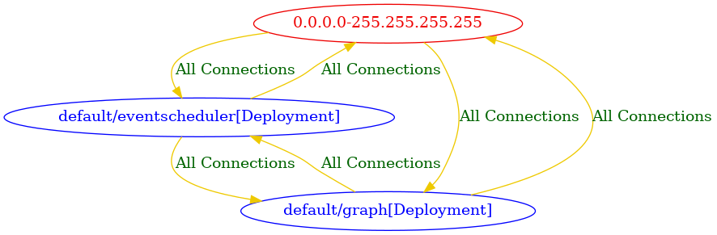

# connectivity-map
Generate a connectivity map file using roxctl netpol connectivity map command and convert the dot file created into a png diagram using Graphviz. This action depends on roxctl tool installed so be sure to use the [setup-roxctl](https://github.com/rprakashg-redhat/setup-roxctl) action to install roxctl as shown in the [example](#example) below

## Usage
```yaml
- uses: rprakashg-redhat/connectivity-map@main
  with:
    # Directory where kubernetes manifest files for application
    manifests-dir: ""
```

## Example
Example workflow below shows how to leverage this action.

```yaml
name: example
on:
  workflow_dispatch:
jobs:
  test:
    runs-on: ubuntu-latest
    steps:
      - uses: actions/checkout@v4
      - id: setup-roxctl
        uses: rprakashg-redhat/setup-roxctl@main
      - name: generate connectivity map
        uses: ./
        with:
          manifests-dir: manifests
        
```

## Connectivity Diagram
Below you can see sample connectivity diagram generated by example workflow


